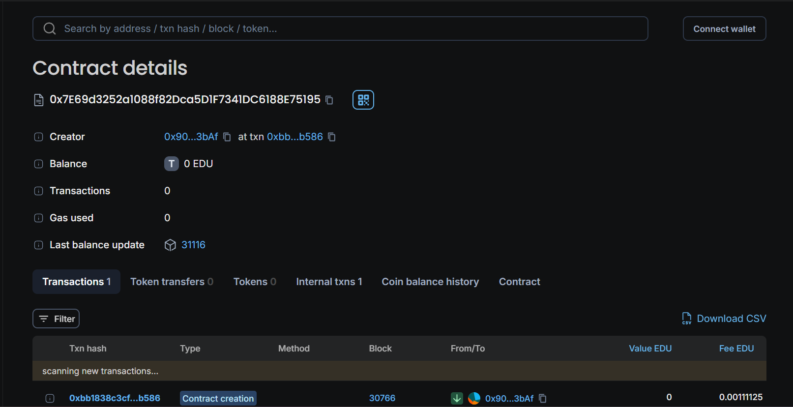

## Project Description:
The Decentralized Voting System is a smart contract-based solution built on the Ethereum blockchain to facilitate transparent and tamper-proof elections. This system allows users to vote for candidates in a secure and decentralized manner, ensuring that each vote is counted accurately and that the election process is fair. The contract is designed to be easily deployable and modifiable, making it suitable for various election scenarios.

## Contract Details:
- **Contract Name:** Voting
- **Network:** Edu Chain
- **Version:** Solidity ^0.8.0
- **Contract Owner Address:** 0x185E37211B28d135C9266684C1419d6CA81aDb03

## Key Functions:
1. **Constructor:** Initializes the contract with a list of candidate names.
2. **addCandidate:** Allows the owner to add new candidates to the election.
3. **vote:** Enables users to cast their vote for a candidate. Ensures each user can vote only once.
4. **getVoteCount:** Retrieves the number of votes a specific candidate has received.
5. **getCandidates:** Provides a list of all candidate names.

## Key Features:
- **Decentralized Voting:** Ensures that voting is conducted on the Ethereum blockchain, making it resistant to tampering and fraud.
- **Transparent Process:** All votes are recorded on the blockchain, providing a transparent record of the election results.
- **Owner Access Control:** Only the owner of the contract can add new candidates.
- **Single Vote Per User:** Prevents multiple votes from the same address to ensure fairness.
- **Event Emission:** Emits an event whenever a vote is cast, allowing for real-time tracking of voting activities.

## Project Vision:
The vision for the Decentralized Voting System is to promote fair and transparent elections in various domains, including political elections, organizational voting, and community decision-making. By leveraging blockchain technology, this system aims to eliminate traditional voting concerns such as fraud, tampering, and lack of transparency. Future enhancements could include features like multi-round voting, candidate verification processes, and integration with user-friendly front-end applications to broaden accessibility and usability.

## Contact Details
For further information or support, please reach out to the project team:

- *Email:* shristigupta.ghy@gmail.com
- *GitHub:* https://github.com/sggit2024
- *LinkedIN:* www.linkedin.com/in/shristi-gupta-1051bb283